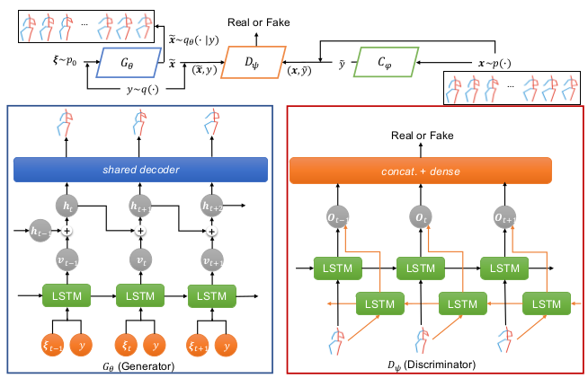
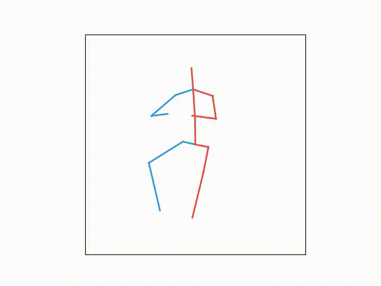
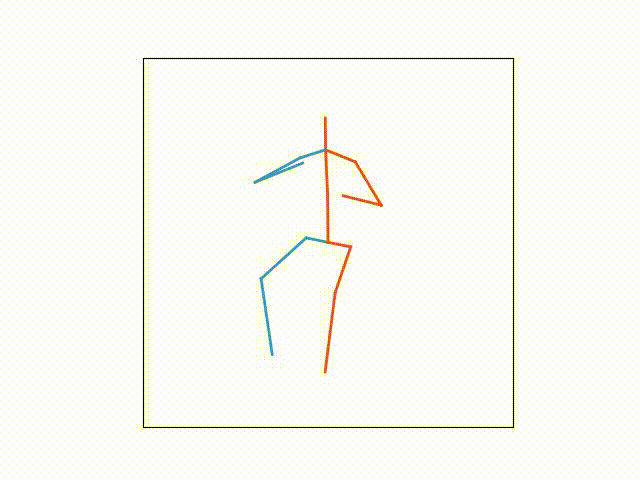
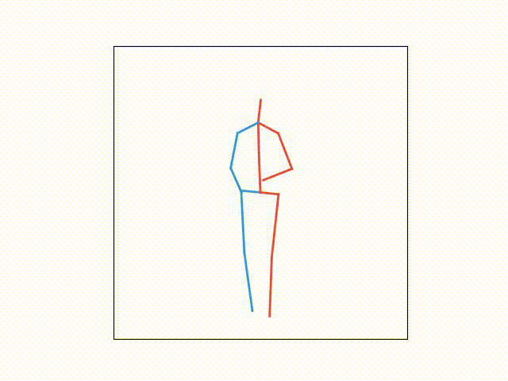
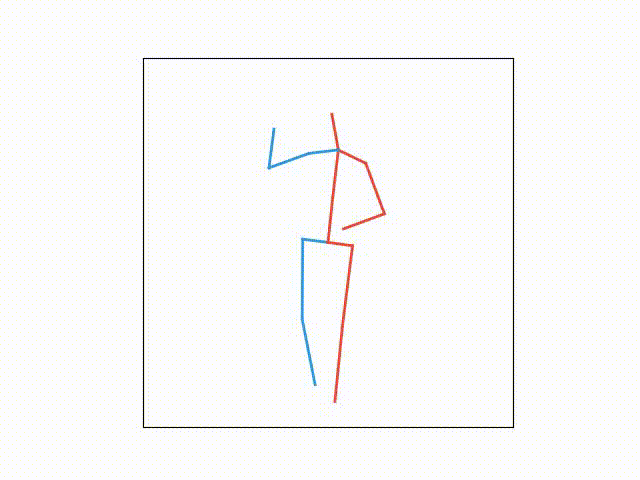
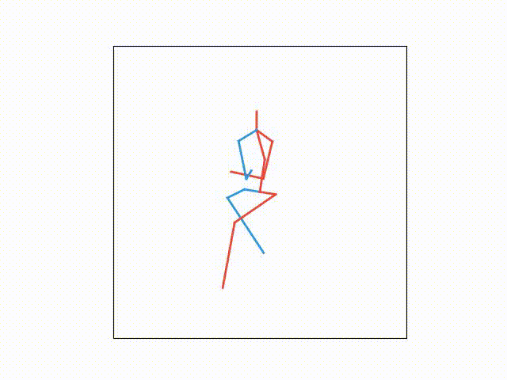
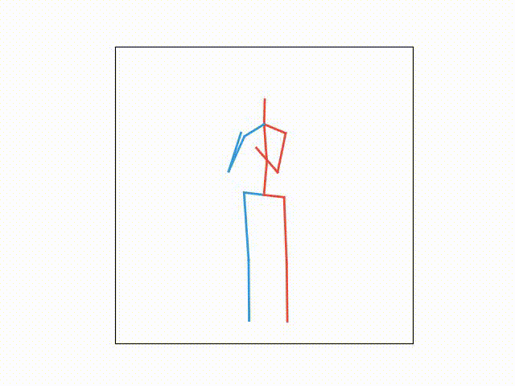

# Learning-Diverse-Stochastic-Human-Action-Generators-by-Learning-Smooth-Latent-Transitions
This code repository contains the tensorflow implementation of the paper “Learning Diverse Stochastic Human-Action Generators by Learning Smooth Latent Transitions”(AAAI 2020).
>@inproceedings{zhenyi2020,
  title={Learning Diverse Stochastic Human-Action Generators by Learning Smooth Latent Transitions},
  author={Zhenyi Wang, Ping Yu, Yang Zhao, Ruiyi Zhang, Yufan Zhou, Junsong Yuan, Changyou Chen},
  booktitle={AAAI},
  year={2020}
}

##  Step0: Download data 
Download human 3.6 2D skeleton data h36m.zip from [this!](https://github.com/una-dinosauria/3d-pose-baseline). Rename the data folder "h36m" as "data" and put the "data" folder in the same directory as the code.

##  Step1: Train the single pose gan
This is used for pretraining the global skeleton-decoder component (GSDC)

python train-dcc.py --mode pose_wgan --batch_size 64 --epoch 200 --actions all --logdir ./logs/pose_wgan_mul --checkpoint_dir ckpt_pose_wgan --learning_rate 1e-3 --val_save --load False --loader saver --pose_dir pose_wgan

##  Step2: Train the pose sequence
Loading one of the saved GSDC model in step 1 and put it in the checkpoint folder 

This is used for training the latent frame sequence GANs.

###  training

python train-dcc.py --mode gan --usemode train --batch_size 32 --epoch 25 --actions all --logdir ./logs/seq_gan --checkpoint_dir checkpoint --learning_rate 0.0001 --val_save --load --loader loader --global_counter 1 --tmp_dir tmp_seq_gan --video_dir video_seq_gan

### testing

1.  select one of saved checkpoints in step 2 and generate action samples for all action classes.
python train-dcc.py --mode gan --usemode test --testmode all_class --batch_size 300 --actions all --logdir ./logs/seq_gan --checkpoint_dir checkpoint  --val_save --load --loader tester --global_counter 1 --tmp_dir tmp_seq_gan --video_dir video_seq_gan
The folder number corresponds to the action classes of
["Directions","Discussion","Eating","Greeting", "Phoning", "Posing", "Sitting", "SittingDown", "Smoking", "Walking"] respectively
Selected examples are shown in below.

#### Eating

    
     
     
    Eating

#### Greeting

    
    
     
    Greeting

#### Smoking

    
     
     
    Smoking

## Prerequesites
Tested under Ubuntu 16.04 and 18.04 LTS with Tensorflow 1.8.0 or higher version

## Acknowledgement
Thanks for the author of "Deep Video Generation, Prediction and Completion of Human Action Sequences" provide their code.
